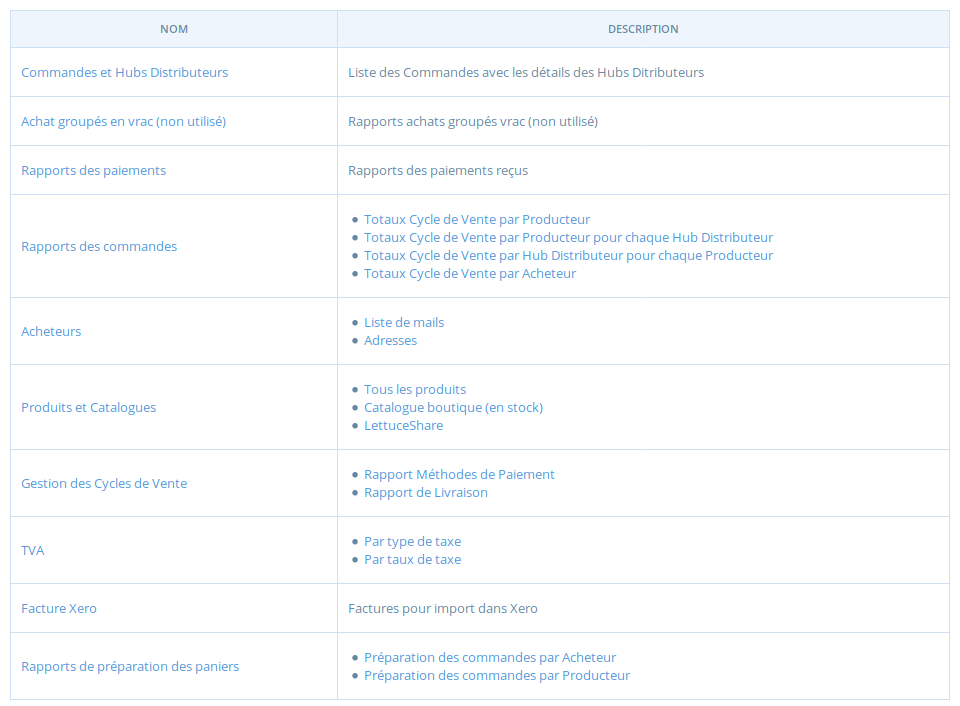
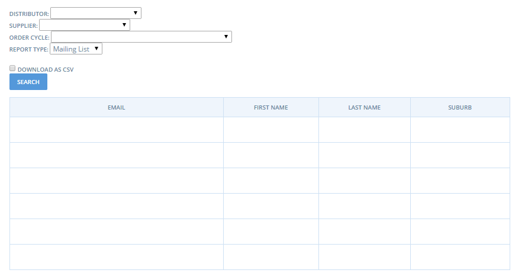
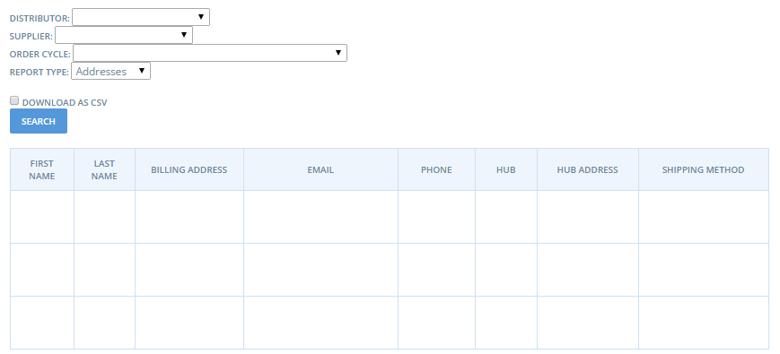
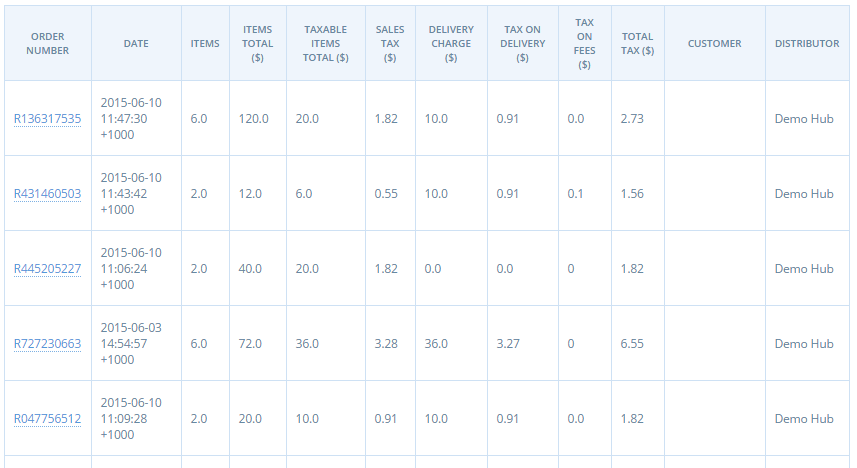

# Rapports

Vous pouvez accéder à la page de génération de rapport via le menu **Rapports**

Vous arrivez sur une page avec une liste de rapports prédéfinis.

Les deux rapports les plus utilisés sont les rapports **Totaux cycle de vente par producteur** et **Totaux cycle de vente par acheteur**. Si en tant que hub vous organiser l'approvisionnement des produits en gros par le producteur puis la mise en panier sur site, le premier rapport vous permettra de gérer vos commandes, le second la préparation des paniers individuels. La **Liste de mails** et les **Adresses** vous serons utiles pour gérer votre communication avec vos acheteurs. Les rapports de **TVA** vous permettront de gérer vos déclarations de TVA. Les **Rapports des paiements** et **Rapport méthodes de paiement** vous permet de savoir ce qui a été payé et comment, et ce qui est dû sur chaque méthode de paiement choisie.

## **Totaux cycle de vente par acheteur**

The picture below shows the information contained in an Order Cycle Customer Totals report. This report can be generated to reflect a particular order cycle by selecting an order cycle from the dropdown menu. As you can see, you may also select to download a CSV copy of this report \(an excel file\). The report shows each customers order, including thier email and contact details, the **product** they ordered, the **amount,**the **item \($\)** and the TOTAL. Lastly it also shows the shipping method they have selected. If you are fulfilling orders on an individual basis, this report gives you all the information to pack the order, contact the customer and arrange for delviery or collection. If you are preparing orders in bulk at the closing of an order cycle, this report can be used to guide your packing and delivery.

## Order Cycle Supplier Totals {#order-cycle-supplier-totals}

The picture below shows the information contained in an Order Cycle Supplier Totals report. Like the above report, this report can also be generated to reflect a particular order cycle by selecting an order cycle from the dropdown menu. As you can see, you may also select to download a CSV copy of this report \(an excel file\). In the report, the supplier is listed on the left. Next is listed all of the **products** and their **variants**, and the **amount** of each that sold. At the closing of an order cycle, this report clearly shows you how much of each product you will need on hand to successfully pack and fulfill all of the orders placed.

## Mailing List {#mailing-list}

The mailing list report shows the names and email addresses of customers who have placed orders in your store. You can filter the report according to order cycle, allowing you to alert customers if there are stock outs or changes to the delivery shedule. See below for an example. As with all reports, the list can be downloaded as a CSV file.

## Addresses {#addresses}

The Addresses report details your customer’s names, addresses, emails, phone numbers and the hub, or store, they shopped with. Again, this report can be filtered by order cycle.

## All Products and Inventory \(on hand\) {#all-products-and-inventory-on-hand}

The All Products and Inventory \(on hand\) reports can be used as a paper copy ordering sheet, for any customers who prefer to order on paper. It lists all of your products and their prices \(see below\). The**All Products**report lists all of your products regardless of whether they have on hand quantities above 0. The**Inventory \(on hand\)**report shows only products which have a positive on hand value.

## Packing Reports {#packing-reports}

Some enterprises use their order confirmation emails as packing sheets, and others will create their own by modifying the Order Cycle Customer Totals report \(above\) to suit their desired format. These packing reports offer two additional options for packing slips.

**Pack by Customer**

This report lists each customer who placed an order. It included each item ordered by the customers, along with the quantity ordered. It’s useful for shops who pack orders customer by customer.

**Pack by supplier**

This report lists each supplier and their products. Next to each product is the name of the customers who ordered this product, and the quantity they ordered. This report is useful for shops who pack orders according to supplier.

## Sales Tax {#sales-tax}

This report is useful to separate the tax component of sales, delivery and fees.

## Bulk Co-op Totals By Suppliers Report {#bulk-co-op-totals-by-suppliers-report}

This report tells shop managers whether they have reached their bulk ordering threshold, and by how much they have exceeded or fallen short of this amount. Note you need to setup bulk sizes for your products before using this feature, see the [Group Buy](https://openfoodnetwork.org/user-guide/advanced-features/group-buy/)advanced feature for instructions.

When their order cycle closes, this report can help the shop to answer the following questions:

* Did customers order enough of this product to justify ordering the bulk size from the supplier?
* If the [Group Buy](https://guide.openfoodnetwork.org/advanced-features/products/group-buy-for-bulk-ordering) tool is enabled, how much extra product are my customers willing to purchase to help the group reach the bulk size threshold?
* How many bulk sizes should the shop order to meet the customer demand?
* If the shop orders the bulk size, how much stock will be left over? Or alternatively, how many customers will be disappointed if this product isn’t ordered?

See the example below for an illustration of how this report can be used:

This is an example of where the bulk ordering quantity has been reached:

This is an example where the bulk order quantity has not been reached:

_Note the ‘Bulk Co-op Allocations’ report is similar in function to this report, but shows each customer’s order individually, rather than the cumulative total across all customers._

