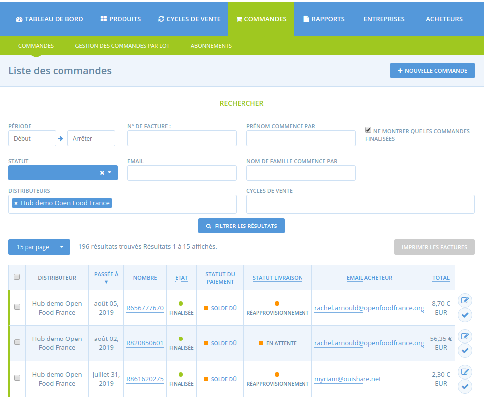
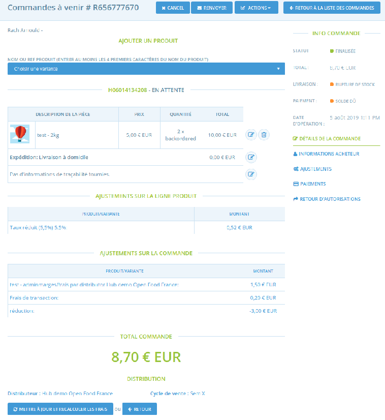
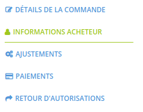
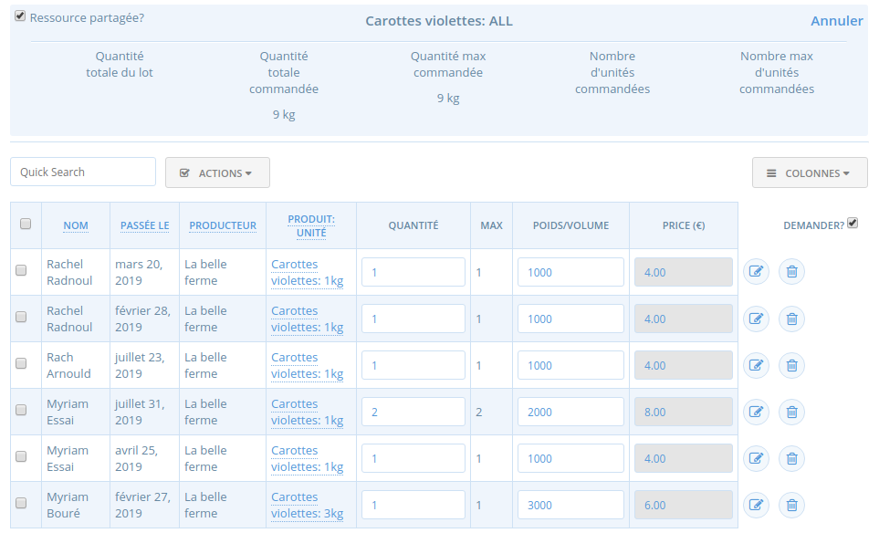
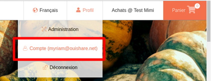
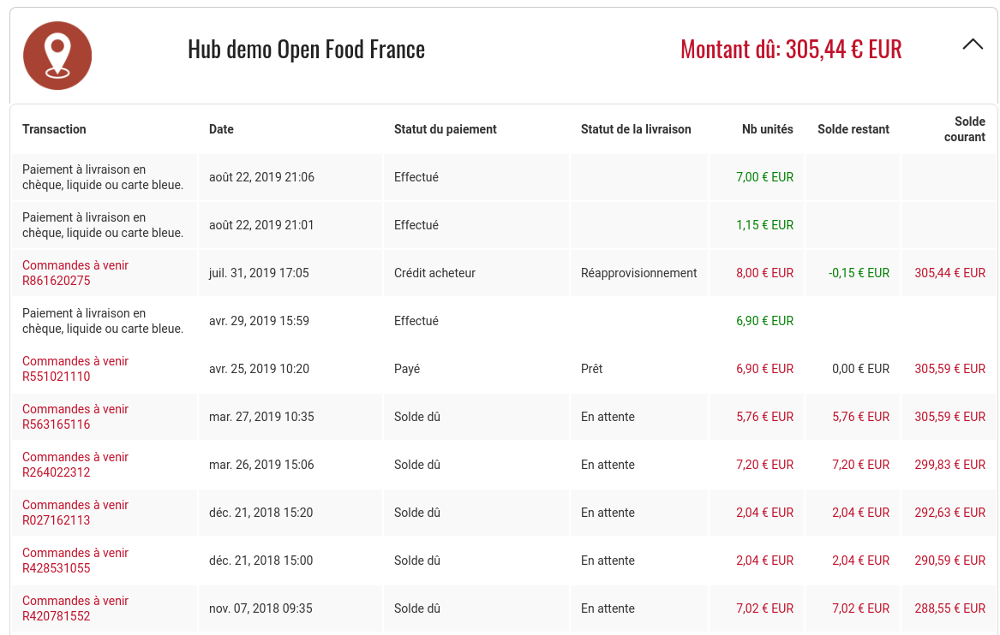

# Gestion des commandes

Le menu "commandes" est divisé en deux sous menu sur Open Food Network : la page "commandes" et la page "gestion des commandes par lot". Cette partie du guide traite des deux pages.

## Liste des commandes

Cette page liste toutes les commandes passées sur la plateforme pour votre /vos boutique\(s\). A partir de cette page, vous pouvez accéder aux détails de chaque commande, les modifier et suivre le statut du paiement et de l'expédition. Pour savoir comment passer manuellement une commande pour le compte d'un acheteur depuis l'interface d'administration, cliquez [ici](manual-orders.md).

Les filtres présents sur la page peuvent vous aider à accéder plus rapidement à la / aux commande\(s\) recherchée\(s\). Vous pouvez filtrer par date, statut, distributeur concerné, cycle de vente, ou via l'email ou le nom de l'acheteur.

**Distributeur :** Il s'agit de l'entreprise \(distributeur\) via laquelle les commandes recherchées ont été passées.

**Date :** Il s'agit de la date à laquelle la commande a été passée.

**N° commande \(mal traduit par "nombre"\) :**  Numéro attribué de manière aléatoire au moment de la commande. Si un petit panneau avec un point d'exclamation figure à côté de ce numéro, cela signifie que l'acheteur a ajouté une note au moment de sa commande. Passez votre souris sur le symbole pour afficher la note. 

**Statut \(mal traduit par "Etat"\) :**

* Finalisée - le client est allée jusqu'au bout de la commande, qui a bien été passée
* Annulée - le gestionnaire du hub a annulé la commande
* Panier - le client a commencé à passer commande mais n'est pas allé jusqu'au bout, la commande n'a pas été passée

**Statut du paiement** **:**

* Solde dû - pour les paiements non automatisés \(paiements en liquide, chèque, par virement bancaire\) le statut du paiement sera par défaut "solde dû", jusqu'à ce que le gestionnaire de la boutique capture manuellement le paiement de la commande. 
* Payé - pour les paiements automatisés \(Paypal, Stripe\) le statut sera automatiquement "payé" au passage de la commande, le portail de paiement renvoyant l'information de la validation du paiement à la plateforme. En cas de paiement en liquide / chèque / virement bancaire, une fois que le gestionnaire a capturé le paiement, le statut s'affiche également comme "payé". 
* Crédit acheteur - si l'acheteur a réglé sa commande mais qu'ensuite cette dernière a été modifiée et qu'un/des produits ont été supprimés, il y a donc un trop perçu pour le hub par rapport au nouveau montant de la commande. Le hub doit de l'argent à l'acheteur pour cette commande. 

**Statut livraison :**

* En attente - Lorsque le statut du paiement est "solde dû", le statut de livraison sera en attente \(tant que le paiement n'est pas reçu, la livraison ne peut pas démarrer __dans un modèle de e-commerce classique. Ce processus n'a pas encore été adapté pour le fonctionnement des hubs alimentaires.\)
* Prêt - Lorsque le paiement est reçu \(statut "payé" ou "crédit acheteur"\), la livraison peut être effectuée \(idem, schéma traditionnel en e-commerce non encore adapté\). 
* Envoyé - Lorsque le gestionnaire capture l'expédition de la commande, le statut s'affiche comme "envoyé". 

_Remarque_ _: Vous ne pouvez pas indiquer une commande à "envoyée" si le statut de paiement n'est PAS "Payé". Nous souhaiterions modifier cela à l'avenir, ce fonctionnement étant adapté au e-commerce classique, mais pas au fonctionnement des circuits courts._

**Email acheteur** **:** Il s'agit de l'email de l'acheteur. Une liste complète des emails des acheteurs peut être téléchargée via le [rapport](../rapports.md) "Acheteurs / liste de mails".

**Total :** Le montant total de la commande.

## **Modifier le statut de paiement ou de livraison d'une commande**

A droite des lignes de commande, vous pouvez opérer deux actions rapides via les boutons suivants :

* Cliquez sur l’icône "check" pour capturer le paiement de la commande \(montant exact\)

* Cliquez sur l’icône "route" pour capturer que la commande a été expédiée


Attention ! La notification de l'expédition par le gestionnaire de hub entraîne l'envoi d'un email à  l'acheteur concerné lui disant que le produit a été expédié et qu'il le recevra sous peu. Si le mode de livraison est de type "retrait", cela peut être perturbant pour l'acheteur. Voir même, si le gestionnaire capture le paiement a posteriori du retrait des produits, et veut marquer la commande comme envoyée, l'acheteur recevra ce message après avoir réceptionné les produits. Soyez donc vigilants et n'utiliser la fonctionnalité de notification de l'expédition que dans les cas appropriés.


Remarque : le statut de paiement et de livraison peut aussi être modifié depuis la page de modification / gestion d'une commande \(voir paragraphe suivant\).

## **Modifier une commande**

A droite de la ligne de commande, le bouton suivant vous permet d'accéder à la page de modification / gestion générale de la commande

Vous pouvez aussi y accéder en cliquant sur le numéro de commande depuis le tableau.

Voilà à quoi ressemble la page de gestion d'une commande :

#### **Ajouter et supprimer des produits d'une commande**

Vous pouvez ajouter un produit en sélectionnant la variante concernée \(vous devez taper les trois premières lettre pour que les options de variantes disponibles apparaissent\). Pour supprimer un produit, il suffit de cliquer sur le petit icône poubelle à côté de la ligne du produit. Vous pouvez aussi modifier les quantités commandées. N'oubliez pas de bien cliquer sur le bouton "**mettre à jour et recalculer les frais"** pour sauvegarder vos modifications et mettre à jour le calcul des marges associées à la commande.

#### Diverses fonctionnalités sont disponibles via le bouton "actions"

* **Renvoyer la confirmation :** Si vous avez modifié le contenu d'une commande, il peut être pertinent de renvoyer une nouvelle confirmation de commande - mise à jour - à l'acheteur.
* **Envoyer la facture :** Cette action entraîne l'envoi automatique par email de la facture correspondant à la commande, au format PDF


Attention : ce document appelé "facture" doit pour la Belgique être modifié pour respecter les obligations légales françaises concernant le numéro de facture. Ici, le numéro de facture est le numéro de commande. La réglementation française impose que les factures émises par une entreprises se suivent selon une numérotation ininterrompue.


* **Imprimer la facture** : Cette action entraîne la génération d'un PDF à imprimer
* **Imprimer ticket de caisse** : Cette action entraîne l'impression du ticket de caisse de la commande via l'imprimante thermique connectée à l'ordinateur \([voir page concernée](thermally-printed-receipts.md)\)
* **Choisir imprimante tickets** : Cette action permet de choisir l'imprimante thermique sur laquelle seront imprimés les tickets de caisse \([voir page concernée](thermally-printed-receipts.md)\)
* **Annuler la commande** : Cette action permet d'annuler la commande

#### Voir les informations acheteurs

Les informations acheteur \(email, adresses de facturation et livraison\) sont accessibles depuis le menu de droite.

**Modifier le montant d'une commande**

Cliquez sur "ajustements" \(cf capture ci-dessus\). Sur cette page vous pouvez ajouter ou supprimer des montants selon votre guise en cliquant sur "nouvel ajustement". Cela vous permet par exemple d'accorder une remise sur une commande car les produits étaient abîmés, ou de prendre en compte un avoir accordé sur une commande précédente.

Un ajustement peut aussi servir à capturer un remboursement effectué à un acheteur sur une commande. Selon la méthode de paiement choisie, la gestion des remboursements ne sera pas la même. [Consultez la page dédiée à ce sujet.](ajustements-de-paiement.md)

#### Capturer un paiement

Un paiement partiel par exemple peut être capturer via  le menu "paiement", ce qui ne peut pas être fait par l'action rapide de capture du paiement via l'icône "check".

## Impression des factures par lot

Il est possible de sélectionner les commandes visibles sur la page \(utilisez l'outil de sélection pour afficher jusqu'à 100 commandes\) afin de générer un PDF agrégeant les factures des commandes sélectionnées via le bouton "imprimer les factures" :

Une fois le bouton cliqué, une fenêtre de chargement s'ouvrira. Lorsque le chargement est terminé un bouton sera affiché afin d'ouvrir dans une nouvelle page le fichier PDF agrégeant toutes les factures correspondantes aux commandes sélectionnées :

## Gestion des commandes par lot

La liste des commandes présente les commandes alors que cette page liste les produits commandés. Cela permet de modifier en masse plusieurs commandes qui contiennent le même produit \(changement de quantité, produit en rupture, etc\). La page se présente la manière suivante :

**Date de début et de fin** **:** Vous pouvez filtrer l'affichage des produits en fonction des dates de commandes.

**Producteur :** Vous pouvez filtrer sur un producteur en particulier.

**Boutique** **:** Vous pouvez filtrer sur une boutique en particulier \(comme sur la capture ci-dessus\).

**Cycle de vente** **:** Vous pouvez filtrer sur un cycle de vente en particulier.

**Quick Search :** Sans aller jusqu'à l'utilisation des filtres, vous pouvez aussi tout simplement taper un mot-clé dans ce champ \(cela peut être le nom d'un acheteur ou d'un produit\).

**Actions :** En cochant les cases à gauche des lignes, vous pouvez appliquer des modifications en masse en passant par le bouton action \(ex : vous souhaitez supprimer toutes les commandes liées à un produit\).

**Colonnes :** Vous pouvez gérer vous-même l'affichage des colonnes qui vous sont utiles \(voir ci-dessous\).

Notez que vous pouvez également trier chaque colonne en cliquant sur son titre. Un clic pour un ordre de A à Z, un second pour l'ordre inverse.


La colonne prix indique le prix TTC hors marges et commissions. Les marges et commission sont recalculées à chaque modification de la commande. 


### Quelques exemples d'utilisation de la fonction gestion des commandes par lot

#### Exemple 1: Vous avez un cas de listeria sur vos fromages de chèvres et ne pourrez donc pas assurer la livraison pour le cycle à venir.

Vous avez donc besoin d'identifier les clients ayant commandé du fromage de chèvre et modifier leurs commandes.

Les étapes seront les suivantes :

1. Filtrez en fonction de la date ou du cycle de vente en cours
2. Tapez "chèvre" en mot-clé : toutes les commandes avec du fromage de chèvre apparaissent.
3. Cliquez sur "fromage de chèvre" dans la colonne "produit : unité"
4. Un message apparaît en haut de page avec la quantité totale commandée :

Vous pouvez alors ajuster la quantité, dans la colonne quantité, ou supprimer des produits. Le total affiché au-dessus se modifiera automatiquement en conséquence. Il peut s'avérer pertinent d'envoyer une alerte email aux clients : **la plateforme ne génère pas automatiquement une alerte lors de la modification d'une commande**.

#### **La case à cocher "ressource partagée"** 

Cette case à cocher permet d'appliquer les modifications à toutes les variantes des produits. En la laissant décochée vous pouvez modifier variante par variante. Dans l'exemple ci-dessous, on voit que les variantes "1kg" et "3kg" du produit carotte sont bien affichées. ****

#### Exemple 2: Vous souhaitez modifier le poids final des produits livrés \(produits non calibrés\).

C'est particulièrement vrai lorsque vous vendez de la viande ou certains légumes \(comme des potimarrons\) ou fromages non calibrés : vous ne savez pas à l'avance le poids final du produit qui sera remis à l'acheteur.

Nous allons prendre l'exemple d'une caisse de viande de 10 kg :

1. Filtrez par date ou cycle de vente
2. Recherchez le produit désiré
3. Rendez les colonnes "Poids/Volume" et "Prix" visibles
4. Modifiez les valeurs de poids \(le prix changera automatiquement\) dans la colonne correspondante
5. Cliquez sur "mettre à jour" dans la barre de bas de page

## Vue acheteur de ses commandes

Vos acheteurs peuvent voir l'historique de leurs commandes ainsi que les soldes créditeurs/débiteurs, depuis leur compte.

Votre acheteur verra l'historique de ses commandes dans toutes les boutiques de la manière suivante : 


Comme vous pouvez le voir, l'acheteur verra à tout moment son solde courant dans votre boutique. Si vous ne capturez pas les paiements à l'issue d'un cycle de vente, les sommes dues vont s'accumuler, alors que l'acheteur aura en fait bien réglé ses commandes. Cela peut prêter à confusion pour l'acheteur, nous vous invitons donc à capturer les paiements de manière rigoureuse.


