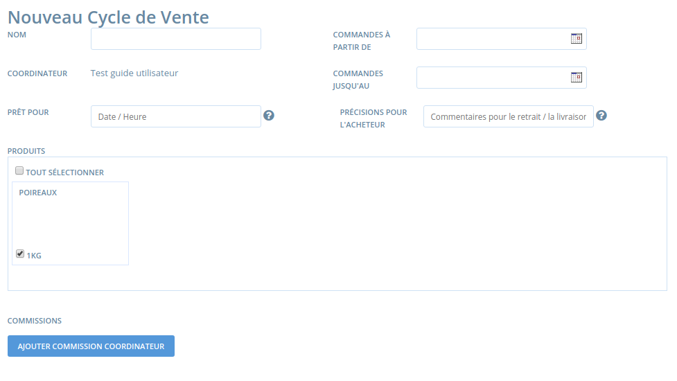

# Cycle de vente géré par un producteur

_\*Vous n'êtes pas producteurs, ou vous êtes producteurs mais avec choisi un type de profil 'Hub producteur" ? Rendez-vous sur_ [_Cycle de vente pour les hubs_](cycle-de-vente-pour-les-hub.md)_._

En créant un cycle de vente, vous définissez les périodes d'ouverture de votre boutique, les produits pouvant être achetés ainsi que les marges et commissions ajoutées sur les prix de base des produits pour couvrir les frais liés à la distribution \(ex: vos frais de transport\).

**Pourquoi gérer par cycle de vente ?** Certains producteurs / fournisseurs préfèrent avoir une ouverture en continu et répondre à chaque commande au fil de l'eau. D'autres fonctionnent par périodes de commande correspondant à un jour de livraison/retrait donné. Par exemple, les ventes seront ouvertes pendant deux semaines \(un cycle de vente de deux semaines\) : à la fin de ces deux semaines, toutes les commandes seront emballées et livrées/réceptionnées en même temps le mercredi suivant. Une fois que ce lot de commandes a été réceptionné, un nouveau cycle de vente redémarre. Cela permet d'optimiser la préparation des commande et le transport, réduisant aussi les frais associés grâce à une logique de massification.

### 1. Créer un nouveau cycle de vente

Connecté en administrateur, rendez-vous sur le menu Cycle de vente ou depuis votre tableau de bord, cliquer sur le bouton suivant :

Puis cliquez sur "Nouveau cycle de vente" :


**Attention !** Vos cycles de vente seront inactifs tant que vous n'aurez pas créé au moins une [méthode de livraison ](../types-de-livraisons.md)et une[ méthode de paiement](../methodes-de-paiements.md)


Vous êtes alors redirigé vers l'écran suivant :

**Nom :** Choisissez un nom pour le cycle de vente. Il sera visible uniquement de vous, donc indiquez quelque chose qui vous permettra de le retrouver facilement ensuite. Par exemple vous pouvez choisir une dénomination type _Semaine26\_2018._

**Commandes à partir de :** La date à laquelle votre boutique commencera à accepter des commandes pour ce cycle de vente.

**Commandes jusqu'au :** La date à laquelle votre boutique arrêtera d'accepter des commandes pour ce cycle de vente. Si vous souhaitez laisser votre boutique ouverte en continue, indiquer une date dans un futur très lointain.

**Prêt pour :** La date à laquelle cette commande sera disponible \(ou livrée\) pour les acheteurs. Vous pouvez indiquer ici un texte libre qui sera utilisé pour nommer ce cycle de vente, par exemple _Vendredi prochain_. Certains hubs "hackent" un peu ce fonctionnement et saisissent ici la nature de la commande concernée par ce cycle de vente, par exemple \(Commande viande pour 23 juillet\).

**Précisions pour l'acheteur :** Les indications précisées ici seront incluses dans l'email de confirmation de commande envoyé au client, juste en-dessous de la méthode de livraison. Ils seront les seuls à obtenir cette information donc vous pouvez y inclure des informations comme des adresses ou numéros de téléphone.

**Produits :** Choisissez ici les produits de votre catalogue que vous souhaitez mettre à la vente dans ce cycle de vente. 


Attention, si vous ajouter des produits après la date de démarrage du cycle de vente, pensez-bien à les ajouter ici aussi pour qu'ils apparaissent en ligne !


**Ajouter commission coordinateur :** Si vous souhaitez appliquer une marge ou commission sur tous les produits figurant dans ce cycle de vente, vous pouvez choisir ici la marge souhaitée parmi les marges et commission prédéfinies \(voir page [Marges et commissions](../frais-et-taxes.md)\).

### 2. Ouvrir la boutique

Cliquez sur "créer" pour créer le cycle de vente. Si la date d'ouverture est déjà passée, votre boutique est instantanément ouverte ! Si vous n'êtes pas prêt à ouvrir tout de suite, indiquez des dates dans le passé ou le futur, que vous pourrez changer ensuite.

Si votre cycle de vente se répète de manière périodique et régulière, vous pouvez dupliquer un cycle de vente passé afin d'aller plus vite \(bouton orange sur la capture, attention il n'est pas orange sur la plateforme\) :

Les cycles de vente sont présentés en vert lorsqu'ils sont actifs, jaune lorsqu'ils sont en attente d'ouverture \(date de début pas encore passée\) et gris lorsqu'ils sont fermés. Un mois après sa fermeture le cycle de vente n’apparaîtra plus dans cette liste, il faudra cliquer sur "voir plus" pour voir tous vos cycles de vente.

