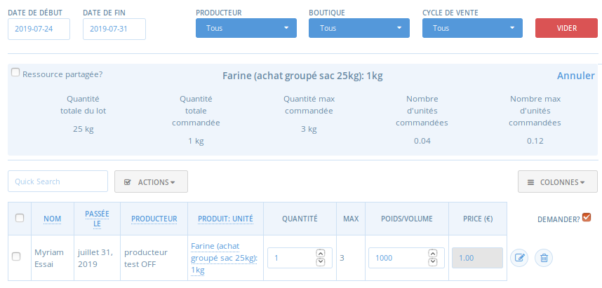

# Option d'achat par lot

Cette fonctionnalité est à destination des entreprises et collectifs qui achètent/produisent certains de leurs produits par lots \(ex: gros volume, sac de 25kg, ou pack de 24 unités, etc.\) et les revendent sous des unités plus petites \(ex: au kg ou à la pièce\). 

L'achat par lot est une pratique courante des groupements d'achat par exemple, qui vont, en achetant de gros volumes bénéficier des prix de gros au même titre que les distributeurs classiques, permettant ainsi à leur membres d'accéder à ces produits pour beaucoup moins cher que dans le commerce.

Lorsqu'un produit est défini comme "étant vendu en lot de x unités", il apparaitra pour l'acheteur dans la boutique avec une double colonne quantité min/max :

Les acheteurs doivent indiquer pour ce produit au moment de la commande :

* La quantité **minimum** qu'ils souhaitent idéalement acheter
* La quantité **maximum** qu'ils sont prêts à acheter si besoin de compléter le lot pour arriver à l'achat d'un lot complet

En résumé, cela signifie que l'acheteur final indique le montant maximum qu'il est prêt à acheter afin de bénéficier de la réduction lié à l'achat en gros volume.

Dans le menu de [gestion des commandes par lot](../commandes/visualisation-des-commandes.md), les quantités minimales et maximales saisies par les acheteurs sont clairement indiquées, vous permettant ainsi de réajuster la quantité commandée jusqu'au seuil maximal, ou de supprimer toutes les commandes d'un produit donné si le minimum de commandes n'est pas atteint.

## Activer l'option d'achat par lot

Sur l'interface d'administration, allez dans le menu Produits, cliquez sur Modifier pour un produit donné, puis rendez-vous sur le sous-menu vertical "options d'achat par lot" :

Sélectionnez "oui". La quantité totale du lot est le nombre exact d'unités que la commande collective doit atteindre si le produit est vendu à la pièce, ou le poids total **en GRAMMES pour les produits vendus au poids et en LITRES pour les produits vendus au volume.**

## Ajuster les commandes pour constituer des lots complets

Dans le menu commandes &gt; gestion des commandes par lot :

1. Sélectionnez le cycle de vente ou les dates concernés
2. Recherchez votre produit \(dans notre exemple ici "Farine \(achat groupé sac 25kg\)\)
3. Veillez à bien afficher la colonne **Max** pour savoir la quantité maximale que les acheteurs acceptent de commander pour remplir le lot
4. Cliquez sur la valeur de la colonne "Produit : unité" \(le nom du produit associé à l'unité de vente\) pour afficher l'encart ci-dessous permettant de lire l'état de complétion du lot
5. Grâce à l'information dans la colonne "nombre max d'unité commandées", vous pouvez augmenter les quantités commandées pour atteindre le lot complet.
6. Sauvegardez vos modifications

**Nombre d'unités commandées** divise ****le total des quantités commandées par la quantité totale du lot. Si le nombre est supérieur à 1, cela signifie que la commande de l'acheteur est équivalente ou supérieure au maximum d'unités du lot. A l'inverse, si le nombre est inférieur à 1, cela signifie que le lot n'est pas encore complet. Plus vous augmentez les quantités commandées, plus ce nombre augmentera également. 

**Nombre max d'unités commandées** récupère la somme de toutes les quantités maximales pour les acheteurs et divise par la quantité totale du lot. SI le nombre est supérieur à 1, vous savez que les quantités totales maximum que les acheteurs consentent à commander dépasse le seuil permettant la commande du lot, vous pouvez donc ajuster les quantités commandées jusqu'à arriver exactement à un nombre pair de nombre d'unités commandées. S'il est inférieur à 0 cela signifie que la quantité maximale n'atteindra pas le seuil et que le lot ne pourra pas être commandé. 

