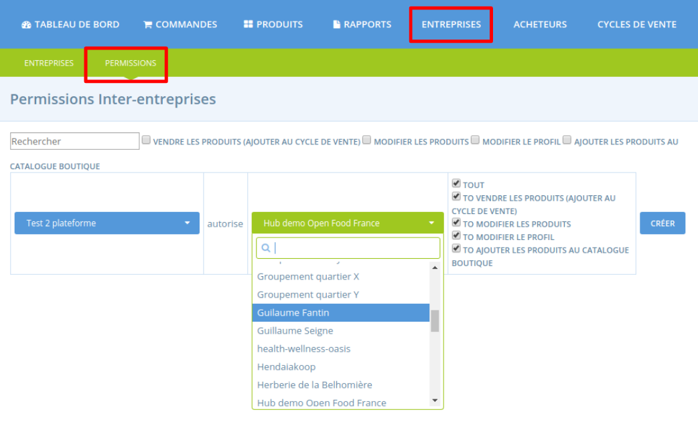

# Permissions inter-entreprises

Ces permissions doivent être octroyées pour qu'une entreprise deviennent fournisseur d'une autre ou inversement qu'une entreprise puisse distribuer les produits d'une autre. Un "droit" est accordé par une entreprise à une autre concernant l'accès / la modification des produits et du profil.

Cette page détaille les différentes permissions possibles et la manière de les allouer. Ensuite deux paragraphes vont plus loin en présentant les permissions depuis deux points de vue différents :

* [**Celui du hub**](e2e-permissions.md#E2Es-from-a-hubs-perspective)
* [**Celui du producteur**](e2e-permissions.md#E2Es-from-a-producers-perspective)

## Les différentes permissions

Il existe 4 différentes permissions. Elles peuvent se combiner de différentes manières afin de donner aux entreprises plus ou moins de droits suivant leurs profils. 

* **Permission de vendre les produits \(= ajouter au cycle de vente\) :** le fournisseur autorise le hub à ajouter ses produits à ses cycles de vente, donc à la vendre.
* **Permission d'ajouter les produits au catalogue boutique :** le fournisseur autorise le hub à ajouter ses produits au catalogue boutique du hub. Le hub pourra alors modifier les prix et stock des produits _uniquement pour sa boutique à lui_, cela n'affectera pas le catalogue du fournisseur.
* **Permission de modifier les produits :** le fournisseur autorise une entreprise \(hub ou producteur\) à créer, supprimer et modifier ses produits directement dans son catalogue fournisseur. Cela peut potentiellement impacter toutes les entreprises ayant accès au catalogue fournisseur car toute modification du catalogue du fournisseur se répercutera sur les distributions qui en sont faites.
* **Permission de modifier le profil :** une entreprise permet à une autre de modifier les détails de son profil \(coordonnées, adresse, description, ...\)

## Donner et gérer les permissions

Pour modifier, ajouter ou supprimer des permissions, rendez-vous sur l'interface d'administration puis dans le menu **Entreprises**, puis sous-menu **Permissions** \(voir capture ci-dessous\). Si vous avez besoin qu'une autre entreprise vous donne des permissions, vous devez les contacter par email ou téléphone. Il n'y a pas de fonctionnalité en ligne pour contacter une autre entreprise à ce sujet.


**Attention** : vous ne pouvez pas gérer les permissions de votre entreprise si vous n'êtes pas gestionnaire de l'entreprise.


Pour accorder une permission, dans la première colonne, sélectionnez votre entreprise et dans la seconde l'entreprise à qui vous donnez des droits. Cliquez ensuite sur le type de permissions que vous souhaitez accorder. Vous pouvez sélectionner plusieurs permissions ou les sélectionner toutes en cliquant sur "TOUT". Puis cliquez sur "Créer". Notez que vous pouvez supprimer ou modifier ces permissions à tout moment.

## Les permissions générées automatiquement

Lorsqu'un utilisateur est gestionnaire principal de plusieurs entreprises sur la plateforme, les 4v permissions sont créées automatiquement entre chaque entreprise. Ce n'est pas le cas entre des entreprises administrées par des utilisateurs différents.

