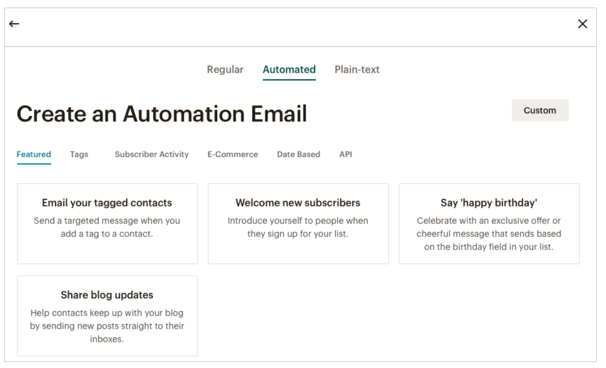
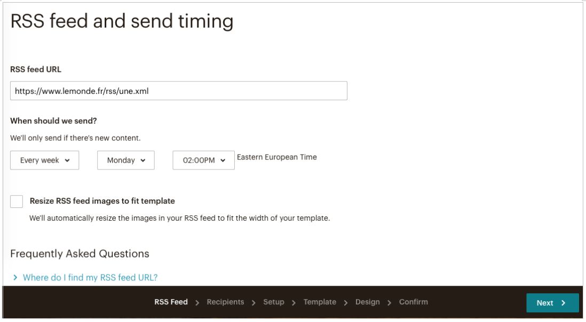

# Communication

Pour votre communication auprès de vos acheteurs ou potentiels acheteurs, vous pouvez utiliser plusieurs logiciels pour l'envoi de lettre d'informations \("newsletter"\). Par exemple, vous pouvez vouloir envoyer :  
- une lettre d'information mensuelle sur l'évolution du projet, les nouveaux produits, les nouvelles des producteurs, etc.  
- un email de notification à chaque fois qu'un nouveau cycle de vente est lancé.

Un des outils les plus courants aujourd'hui est [Mailchimp](https://mailchimp.com/fr/help/), nous vous proposons donc ici quelques "trucs et astuces" pour utiliser Mailchimp pour l'envoi de vos lettres d'information.

## Automatiser l'extraction des emails de vos acheteurs Open Food Network vers votre liste de destinataires sur Mailchimp

Il est possible de "connecter" la plateforme Open Food Network avec Mailchimp pour que dès qu'un nouvel acheteur passe commande dans votre boutique, il soit automatiquement ajouté à la liste de vos destinataires dans Mailchimp. Cela requiert une "intégration" automatisée, si vous souhaitez effectuer cette connexion merci de nous contacter à support@openfoodfrance.org.

## Comment envoyer le même email à mes acheteurs chaque semaine de façon automatique via Mailchimp ?

Si vous souhaitez envoyer chaque semaine le même email à vos contacts via MailChimp, voici la procédure à suivre \(cela peut être utile pour annoncer chaque semaine l’ouverture de votre cycle de vente par exemple\).

* Dans le menu de MailChimp, cliquer sur « Campaigns » puis sur « create campaign » et choisissez la sous-catégorie « Email ».
* Cliquez sur « Automated » puis sur « Share Blog updates ».

* Donnez un nom à votre campagne dans le champ « Campaign Name ».
* Choisissez l’audience dans la liste déroulante « Select an audience ». Il s’agit de la mailing list qui recevra votre email. Puis cliquez sur « Begin ». \(NB : si vous n’avez pas encore créé d’audience, vous pouvez le faire via le menu « Audience » sur la page principale de Mailchimp\)
* Dans le champ RSS feed URL, renseignez par exemple une des adresses suivantes :

   [https://www.lemonde.fr/rss/une.xml](https://www.lemonde.fr/rss/une.xml) 

   [http://rss.nytimes.com/services/xml/rss/nyt/HomePage.xml](http://rss.nytimes.com/services/xml/rss/nyt/HomePage.xml)  
   [https://www.theatlantic.com/feed/all/](https://www.theatlantic.com/feed/all/)  
   [https://www.politico.com/rss/politicopicks.xml](https://www.politico.com/rss/politicopicks.xml)

   Il faut choisir l’adresse d’un flux RSS qui poste des articles chaque jour afin que cela déclenche automatiquement votre campagne RSS : [https://kb.mailchimp.com/campaigns/blog-posts-in-campaigns/share-your-blog-posts-with-mailchimp](https://kb.mailchimp.com/campaigns/blog-posts-in-campaigns/share-your-blog-posts-with-mailchimp).  
  Oui oui, c'est un peu un "hack" de leur système :-\)

* Choisissez ensuite quand vous souhaitez que votre email soit envoyé : par exemple « Every week » « Monday » “ 02:00PM” signifie que votre email sera envoyé chaque lundi toutes les semaines à 14h.

* Cliquez ensuite sur « Next » tout en bas à droite de la page.
* Choisissez si l’envoi doit être effectué à toute votre audience \(« Entire Audience »\) ou à un segment uniquement. Puis cliquez sur « Next ».

Vous pouvez ensuite personnaliser chaque champ de votre email comme d’habitude sous Mailchimp et lancer votre campagne.

